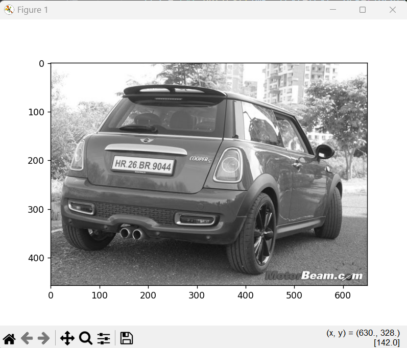
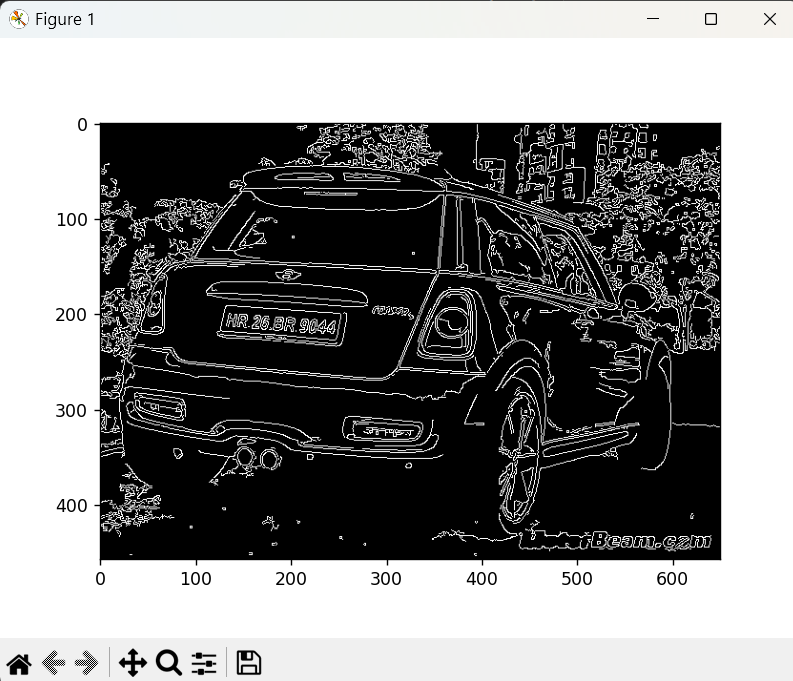
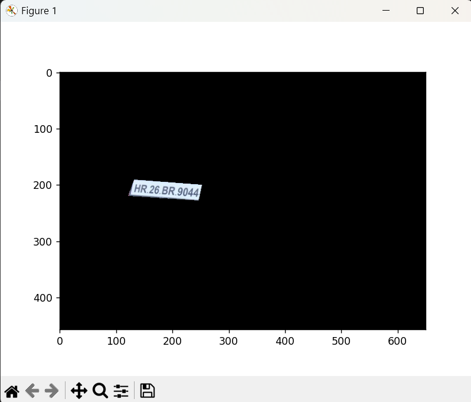
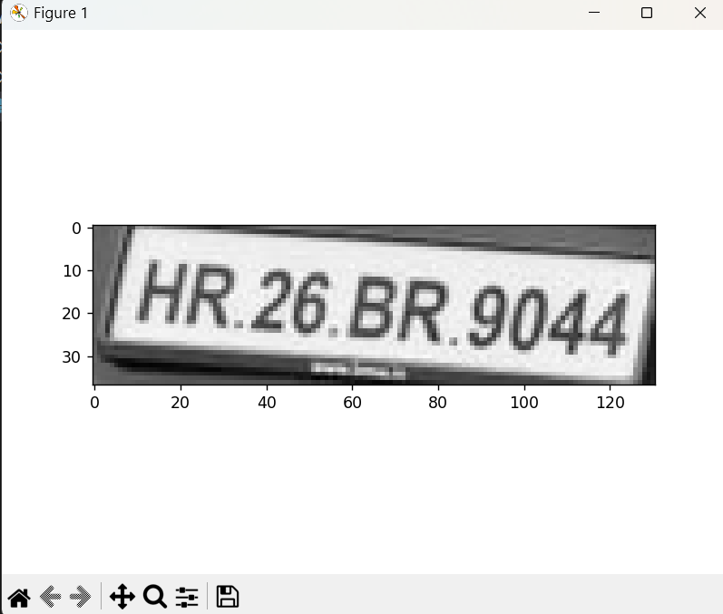
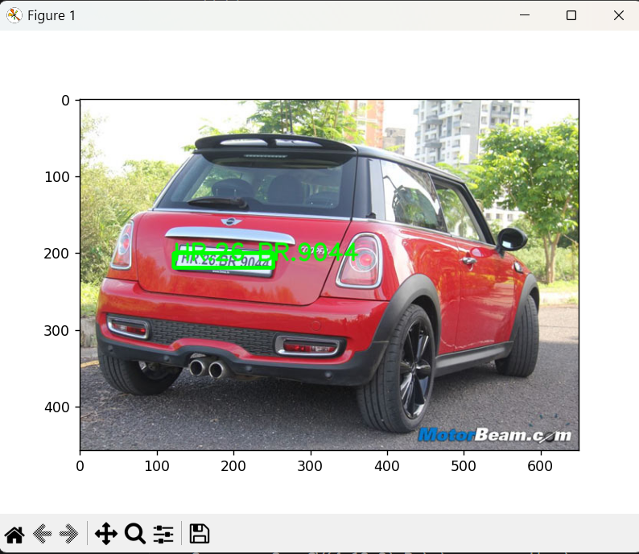
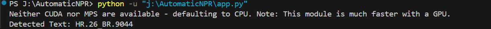

# Automatic License Plate Recognition (ANPR)

This project demonstrates Automatic License Plate Recognition (ANPR) using OpenCV, EasyOCR, and Python. The script processes an input image to detect and extract text from a license plate.

## Features
- **Grayscale Conversion**: Converts input images to grayscale for preprocessing.
- **Noise Reduction**: Applies bilateral filtering to reduce noise while preserving edges.
- **Edge Detection**: Detects edges using the Canny Edge Detection method.
- **Contour Detection**: Identifies potential regions containing license plates based on contours.
- **EasyOCR Integration**: Reads and extracts text from the detected license plate.
- **Visualization**: Displays intermediate processing steps and final annotated images.

---

## Requirements

The following Python packages are required to run the project:
- `numpy`
- `opencv-python`
- `matplotlib`
- `easyocr`

Install dependencies using:
```bash
pip install -r requirements.txt
```

```bash
.
├── Images
│   └── image1.jpg      # Sample image to test the script
├── anpr.py             # Main Python script
├── requirements.txt    # List of required Python packages
└── README.md           # Project documentation
```

## Usage
1. Clone the repository:

```bash
git clone https://github.com/your-username/automatic-npr.git
cd automatic-npr
```

2. Add your image files to the Images folder.

3. Run the script:
```bash
python anpr.py
```
Replace the image path in the script with your own image path if necessary:
```bash
RunProcess('./Images/image1.jpg')
```


The script displays the following steps for Example Input Image
Sample input image 'image1.jpg' placed in the Images directory.

Output
Detected license plate region::

1. Grayscale image of the input.

2. Edge-detected image.

3. Detected contour region.

4. Cropped license plate region.

5. Annotated image with the detected text.


The detected text is also printed in the console.
